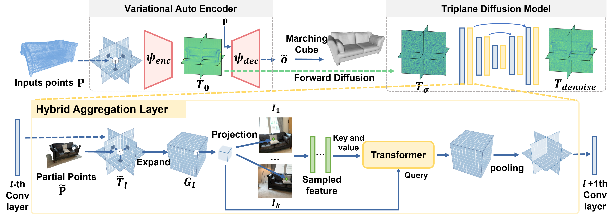

# DisCo: Diffusion-based Cross-modal Shape Reconstruction

## ✨ Overview
This repository contains code, models, and demos for a Cross-modal Shape Reconstruction Model called DisCo. Key features:
* Utilizes Triplane Diffusion Transformers (Triplane-DiT) for memory-efficient 3D reconstruciotn
* Robustly processes multi-view images, adeptly handling real-world challenges such as occlusion and motion blur
* Seamlessly integrates point cloud and posed image data and achieve metric-scale 3D reconstructions
* Trained on high-quality 3D datasets (LASA, ABO, 3DFRONT, ShapeNet)

<p align="center">
  
</p>

## Contents
* [Environment Setup](##-Environment-Setup)
* [Inference](#Inference)
* [Data Prepration](#Data-Preparation)
* [Train](#Train)
* [Acknowledgement](#Acknowledgements)
* [Citation](#Bibtex)

## Environment Setup

<details> <summary>Hardware</summary>
We train our model on 8x A100 GPUs with a batch size of 22 per GPU. 
</details>

<details> <summary>Setup environment</summary>
The following steps have been tested on Ubuntu20.04.
- You must have an NVIDIA graphics card with at least 12GB VRAM and have [CUDA](https://developer.nvidia.com/cuda-downloads) installed.
- Install `Python >= 3.8`.
- Install `PyTorch==2.3.0` and `torchvision==0.18.0`.
```sh
pip install torch==2.3.0 torchvision==0.18.0 --index-url https://download.pytorch.org/whl/cu118
pip install torch-scatter -f https://data.pyg.org/whl/torch-2.3.0+cu118.html
```

- Install dependencies:

```sh
pip install -r requirements.txt
```

- Install DisCo:

```sh
pip install -e .
```
</details>

## Inference
<details> <summary>Prepare Pretrained Weights</summary>

* Download the pretrained weight from [BaiduYun](https://pan.baidu.com/s/10liUOaC4CXGn7bN6SQkZsw?pwd=hlf9) or [SharePoint](https://cuhko365.sharepoint.com/:f:/s/CUHKSZ_SSE_GAP-Lab2/EiqBn0E9VANPmo0h0DMuSOUBJpR_Cy6rHIvDzlz169pcBA?e=Kd8TTz). 

* Put `ae`,`dm`, and `finetune_diffusion` folder under DisCo/output. Only the ae and finetune_dm is needed for final evaluation:  
   * The `ae` folder stores the VAE weight, 
   * `dm` folder stores the diffusion model trained on synthetic data.
   * `finetune_dm` folder stores the diffusion model finetuned on LASA dataset. 
</details>


## Data preparation
1. Follow the instruction in [DATA.md](https://github.com/GAP-LAB-CUHK-SZ/LASA/blob/main/arkitscene_process_script/DATA.md)
to obtain training data.
<br>
2. Download open_clip_pytorch_model.bin from [SharePoint](https://cuhko365.sharepoint.com/:f:/s/CUHKSZ_SSE_GAP-Lab2/EiqBn0E9VANPmo0h0DMuSOUBJpR_Cy6rHIvDzlz169pcBA?e=Kd8TTz) 
and put it under `DisCo/data` directory. This weight file is for extracting images' vit features.

[//]: # (1. **Download and Organize Data**)

[//]: # (   - Download the preprocessed data from [BaiduYun &#40;code: r7vs&#41;]&#40;https://pan.baidu.com/s/1X6k82UNG-1hV_FIthnlwcQ?pwd=r7vs&#41;.)

[//]: # (   - After downloading, place all the data under the `LASA` directory.)

[//]: # (   - Unzip `align_mat_all.zip` manually.)

[//]: # ()
[//]: # (2. **Unzip All Data**)

[//]: # (   - You can use the provided script to unzip all data in `occ_data` and `other_data` directories.)

[//]: # (   - Run the script to unzip the data:)

[//]: # (     ```sh)

[//]: # (     python data/unzip_all_data.py --unzip_occ --unzip_other)

[//]: # (     ```)

[//]: # ()
[//]: # (3. **Generate Train/Validation Splits**)

[//]: # (   - Navigate to the `process_scripts` directory:)

[//]: # (     ```)

[//]: # (     python data/generate_split_for_arkit.py --cat arkit_chair)

[//]: # (     ```)

## Train && Evaluation
1. **Train the Triplane-VAE Model**
   ```
   python launch.py --mode train_vae --gpus 0,1,2,3,4,5,6,7 --category chair
   ```

2. **Cache Image and Triplane Features**
   ```
   python launch.py  --mode cache_image_features --gpus 0,1,2,3,4,5,6,7 --category chair
   python launch.py  --mode cache_triplane_features --gpus 0,1,2,3,4,5,6,7 --category chair
   ```

3. **Train the Triplane-Diffusion Model on Synthetic dataset**
   ```
   python launch.py  --mode train_diffusion --gpus 0,1,2,3,4,5,6,7 --category chair
   ```
4. **Finetune the Triplane-Diffusion Model on LASA dataset**
   ```
   python launch.py  --mode finetune_diffusion --gpus 0,1,2,3,4,5,6,7 --category chair
   ```
   
5**Evaluate the trained Tripalne-VAE and Tripalne-Diffusion Model**
   Comming soon
